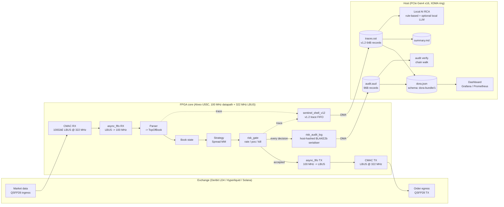

# Sentinel-HFT — architecture

This document covers the system at two levels: the RTL pipeline that
runs on the Alveo U55C, and the host-side Python toolkit that turns
the RTL's binary artifacts into human-readable evidence.

## Block diagram

## RTL layer

The heart of the FPGA-side pipeline is `sentinel_shell_v12`
(instrumentation wrapper) plus `risk_gate` (deterministic pre-trade
checks) plus `risk_audit_log` (ordered per-decision record serialiser
— cryptographic chain is constructed on the host via BLAKE2b; see
§"Audit trail layer" below). All three live in [`rtl/`](../rtl/)
and share a small set of packages (`trace_pkg_v12`, `risk_pkg`)
that define the wire formats. The top-level wrapper for the Alveo
U55C is
[`fpga/u55c/sentinel_u55c_top.sv`](../fpga/u55c/sentinel_u55c_top.sv).
The XDC and build scripts live next to it.

The Ethernet ingress and egress paths are bridged from the CMAC
hard-macro LBUS domain (322.265625 MHz) into the 100 MHz datapath
by two `async_fifo` instances with gray-coded pointers, backed by
`reset_sync` reset synchronisers on each clock. Wave 2 closed the
previous audit finding (E-S1-02/03) that the shim implicitly
assumed both clocks were the same — see `rtl/async_fifo.sv` and
`rtl/reset_sync.sv`. The XDC
(`fpga/u55c/constraints/sentinel_u55c.xdc`) declares the two
clocks asynchronous and documents the recommended
`set_max_delay -datapath_only` entries for the pointer
crossings.

The shell's job is to wrap the existing trading core without changing
its behaviour. On every transaction it captures `t_ingress` and
`t_egress` cycle counters and emits a 64-byte trace record through a
sync FIFO. Attribution is per stage: ingress, core, risk, egress, and
the difference between `t_egress - t_ingress` and the sum of those is
the "overhead" bucket (queueing, shell serialisation, FIFO wait).

The risk gate is one-decision-per-cycle combinational logic with
registered outputs. Orders flow through unmodified — the gate
attaches a `passed` flag and a `reject_reason` so downstream logic
can drop rejected orders without any additional latency. The three
primitives are a token-bucket rate limiter (accepts NEW orders as
long as tokens are available, CANCELs are free), a position limiter
(tracks long, short, and net notional and rejects if the *after*
position would exceed any configured cap), and a kill switch
(hardware latch that blocks all orders once tripped, either manually
via `cmd_kill_trigger` or automatically via a loss threshold).

Every decision (passed or rejected, including kill-switch trips)
emits an audit record through `risk_audit_log`. The RTL is a pure
*serialiser*: it advances a monotonic `seq_no`, packs the decision
fields, and exposes a 128-bit `prev_hash_lo` input port that is
driven by the host over DMA. The RTL does not compute any hash —
that is deliberate (BLAKE2b in hardware is expensive silicon that
adds no trust, since the host would have to recompute it anyway to
verify). What the RTL *does* enforce on chip is the chaining
*discipline*: `seq_no` advances only on committed writes, the
overflow-tagged record is emitted when the sink stalls, and
`prev_hash_lo` is captured into the record at commit time rather
than at dispatch. The host-side verifier then re-computes BLAKE2b
over each committed payload, walks `prev_hash_lo` to prove no record
was altered or inserted, and flags the first break (if any) with the
record's sequence number.

## Host layer

Four artifacts fall out of every demo run.

`traces.sst` is a binary trace file — 32-byte magic header (`"SNTL"`
+ version + clock rate) followed by a stream of 64-byte v1.2 records.
The `SentinelV12Adapter` in
[`sentinel_hft/adapters/`](../sentinel_hft/adapters/) parses this.
`StreamingMetrics` turns the record stream into P50/P90/P99/P99.9
quantiles using P² estimators (O(1) memory, ±0.5% accuracy at 10K+
samples).

`audit.aud` is a stream of 96-byte risk decisions. The verifier
(`sentinel-hft audit verify`) re-computes hashes, walks the chain,
and reports the first break if any. Truncation is tolerated: if the
last K records are lost the first N-K still verify. Reordering,
insertion, and mutation all break the chain.

`dora.json` is the packaged evidence bundle. Schema `dora-bundle/1`.
It covers the run window, the decisions taken, the audit chain
state, and the latency distribution. A compliance engineer or a risk
officer can hand this file to a regulator without including the
underlying trace records, since the bundle includes a hash commitment
to each artifact.

`summary.md` is the human-readable run summary. Head hash, pass rate,
kill status, latency quantiles, per-instrument breakdown.

## AI RCA

The local AI root-cause explainer operates on the trace + audit
bundle. It is deliberately designed not to ship trace content off the
host. The default mode is rule-based — a small rules engine that
looks at the latency distribution, the reject-reason histogram, and
any chain breaks, and produces a plain-English narrative with no
network calls. An optional mode uses a local LLM via Ollama or
llama.cpp for a richer narrative; the prompt carries only the
aggregate metrics and a summary of the run window, so individual
records never leave the host. The old path that called Anthropic's
API directly is still supported for interactive development, but is
off by default and requires an explicit opt-in in the config.

This design is what lets Sentinel-HFT live in a production staging
environment at an HFT firm. The firms we've talked to don't adopt
tools that route trace content through a third-party LLM endpoint,
regardless of the marketing.

## On-chain attribution

Same trace format, different ingress adapter. The Hyperliquid /
Solana adapter lives under
[`sentinel_hft/onchain/`](../sentinel_hft/onchain/) and normalises
block-inclusion latency, sequencer RTT, and intent-flow attribution
into the same 64-byte v1.2 record shape. The result is that a single
dashboard covers both the CEX path (wire-to-wire on LD4) and the
on-chain path (user-intent to block-inclusion), with the same
quantile estimators running against both.

## Determinism and reproducibility

The whole demo is deterministic. The Deribit fixture is seeded
(seed=1 by default), the risk-gate timestamp is clamped monotonic at
the pipeline level, and the BLAKE2b chain's head hash is emitted
alongside the summary. Two runs with the same seed produce the same
`head_hash`, which is what the E2E regression test
(`tests/test_e2e_demo.py`) pins against. If a refactor changes the
head hash, the test fails and the reviewer has to decide whether the
change was intentional.
